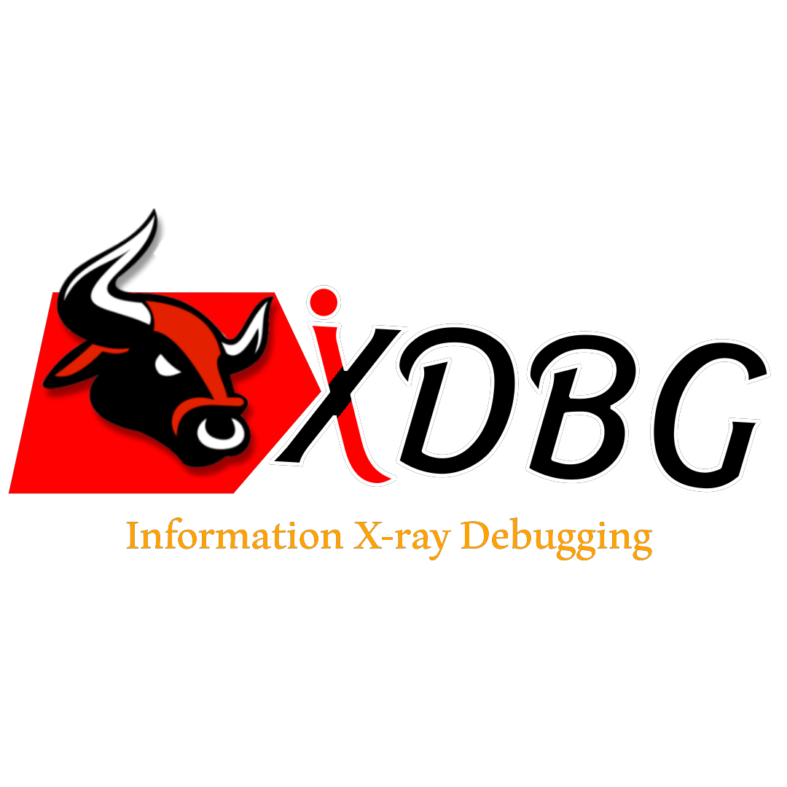

### **مصحح الأشعة السينية للمعلومات (Information X-ray Debugging)**

<span style="background-color:white; color:white; padding:5px 100px; border-radius:10px; font-weight:bold; display:inline-flex; align-items:center;">
  
</span>

### 


### 

---
## **البرنامج يدعم اللغة العربية**


**البرنامج هو أداة لتحليل الملفات** `(*.exe *.dll)` **لكشف معلومات مهمة عنها واكتشاف الأنماط المشبوهة. الوظائف الرئيسية للبرنامج هي:**

- **1. تحليل الاستيراد:** يعرض جميع المكتبات التي يستدعيها الملف التنفيذي مثل `user32.dll` أو `kernel32.dll`

- **2. تحليل LIEF:** يستخدم مكتبة `LIEF` لاستخراج معلومات عن المكتبات والملفات المرتبطة بالملف التنفيذي

- **3. تحليل التصدير:** يعرض الوظائف التي يوفرها الملف التنفيذي للمستخدمين أو للتطبيقات الأخرى

- **4. نقطة الدخول** `تفكيك التعليمات البرمجية (Disassembly)` **يقوم بتفكيك الكود عند نقطة الدخول باستخدام مكتبة `capstone` لكشف الكود الأولي**

- **5. اكتشاف الكلمات المشبوهة:** يبحث داخل محتوى الملف عن كلمات مفتاحية مشبوهة مثل `powershell` أو `cmd.exe` والتي قد تشير إلى نشاط ضار

- **6. حفظ البيانات إلى** `(*.JSON)` **جميع التحليلات يمكن حفظها في ملف JSON للمراجعة لاحقًا**

---

- ### **كيفية تنصيب البرنامج؟**

---

- ## **تثبيت الحزم**

```
$ setup.bat
```

---

- ## **تشغيل البرنامج**

```
$ run.vbs
```

--- 

- ## **كيفية الغاء التثبيت؟**

```
$ python uninstall.py
```

---


### 

- [](https://www.instagram.com/wsl.iq)
- [](https://t.me/wsl-iq)
- [](https://www.tiktok.com/@wsl.iq)

---
